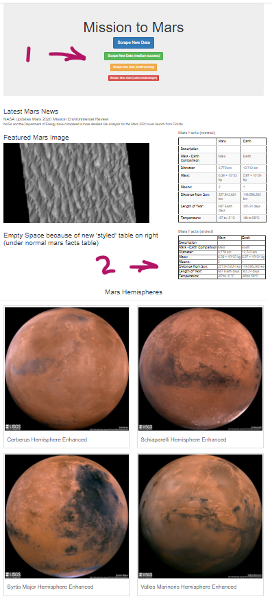
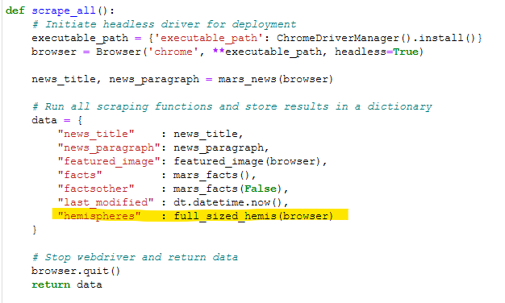
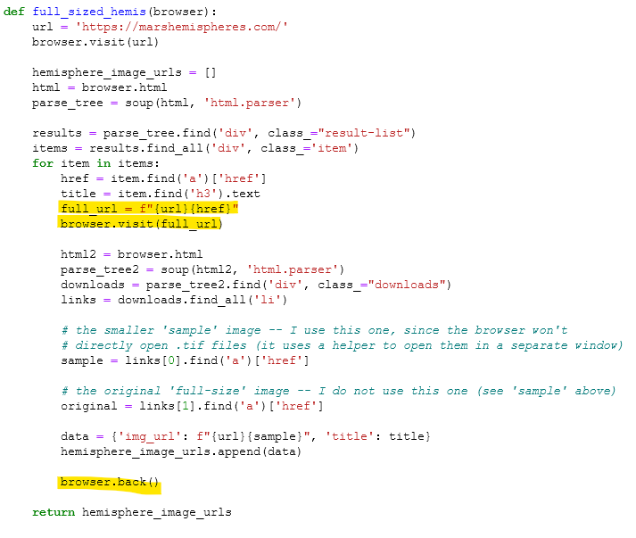
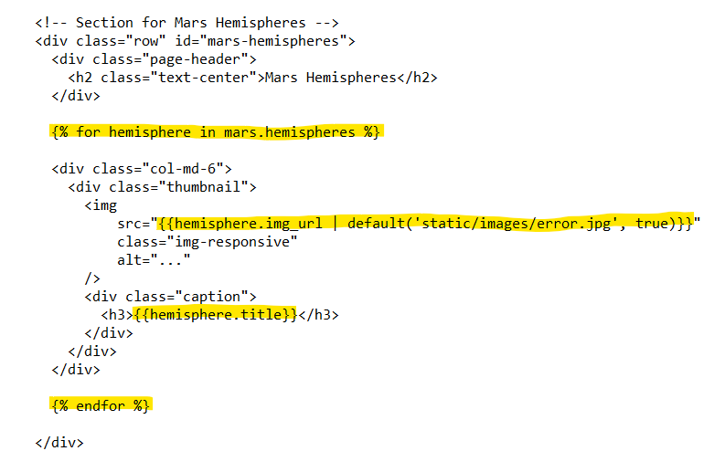
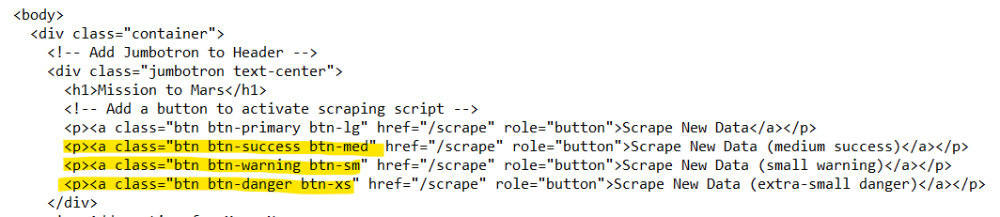
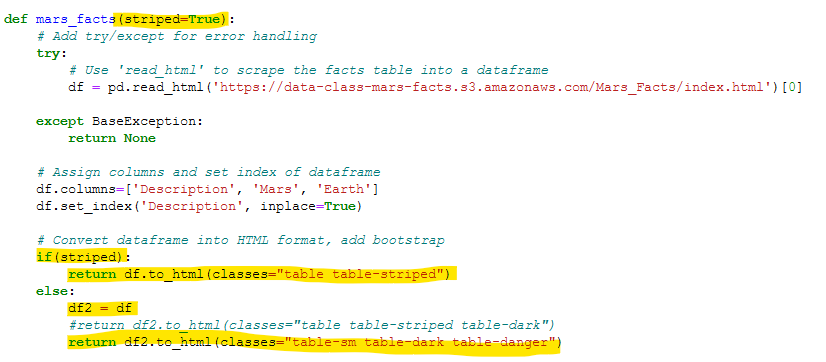

# Mission-to-Mars

## Project Overview

In this module, we automated a web browser to visit different websites to extract data about the Mission to Mars. We stored it in a NoSQL database (MongoDB), and then rendered the data in a web application created with Flask.

Technologies used:
- Bootstrap
- Beautiful Soup
- Flask
- MongoDB
- Splinter
- Chrome Driver

## Results

#### Final Product

In Figure 1 below, we see the Jumbotron Bootstrap component with the heading 'Mission to Mars' with two additional customizations: 1) multiple versions of the 'Scrap New Data' button with different styling, and 2) a second version of the 'Mars Facts' DataFrame using both the 'table-sm' and 'table-dark' style.

Figure 1 - Final version of Flask-generated web page

#### Deliverable 1: Scrape Full-Resolution Mars Hemisphere Images and Titles

In Figure 2 below, we see the code to:
- Retrieve the full-sized images of the four views of Mars' hemispheres. (Note that the .jpg versions were used, since the .tiff versions were pretty huge and don't really add any value).
- Retrieve the title for each of the four images.
- Create a new dictionary containing the URL and title for each hemisphere
- Add each of these dictionaries into a list
- Return the list to the caller of the function

Figure 2 - The list of dictionaries of image titles and URLs

#### Deliverable 2: Update the Web App with Mars Hemisphere Images and Titles

This deliverable required several things:
- Add a key/value pair to the 'data' dictionary which gets stored in MongoDB (Figure 3)
- A new function to visit a URL to retrieve the required data (Figure 4)
- Additional code using Flask's templating engine called Jinja, which is inserted into index.html (Figure 5)

Note that the new key/value pair in the data dictionary has a 'value' which is a function call. The return value from the 'full_sized_hemis(browser)' call will be stored with the key='hemispheres', and subsequently stored into MongoDB for later recall.

Figure 3 - The new 'hemispheres' key/value pair in the data dictionary

Figure 4 - The function to retrieve the hemisphere data

Figure 5 - The new HTML code using Jinja template code

#### Deliverable 3: Add Bootstrap 3 Components

This deliverable required the use of two additonal Bootstrap features to style components. I chose the following:

- Button styling for the 'Scrape New Data' in the Jumbotron header component (Figure 6). Note the different colors and sizes at the '1' note in Figure 1.
- Table styling for the 'Mars Facts' table (Figure 7). Note the second copy of the 'Mars Facts' table at the '2' note in Figure 1. This feature didn't actually work as described in the Bootstrap documentation. My approach was to modify the 'mars_facts()' function to return HTML code for the dataframe with different styles based on an argument. At first, I planned to use the 'striped' styling, which was barely noticeable at all when rendered in the browser. Then I tried to use 'table-dark' style, which didn't work at all. Finally, I tried 'table-sm', which did make a very slight difference in the size of the second 'mars_facts' table (see the '2' note in Figure 1).

Figure 6 - Bootstrap button styling worked well

Figure 7 - Bootstrap table styling did not work so well

## Summary

The goals of this project were achieved, but it took quite a lot longer than the budget estimate given in the online Module text. The biggest time overruns were because of the tweaking required to get the Jinja HTML templating and various CSS-related functionality to work properly.
